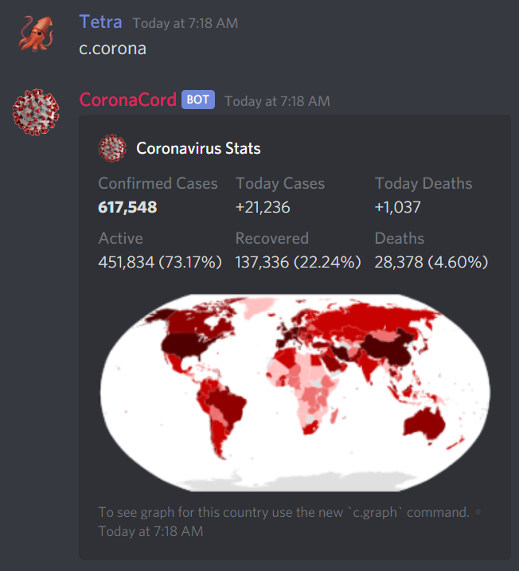
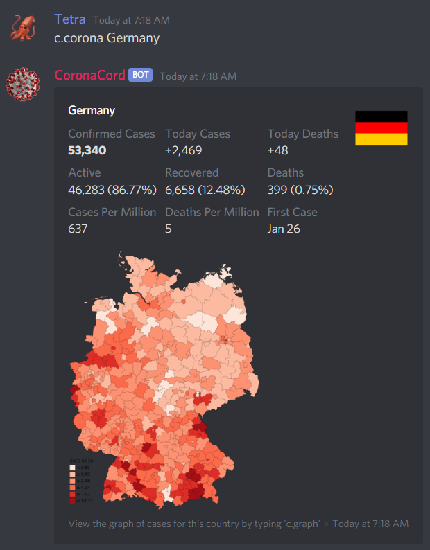
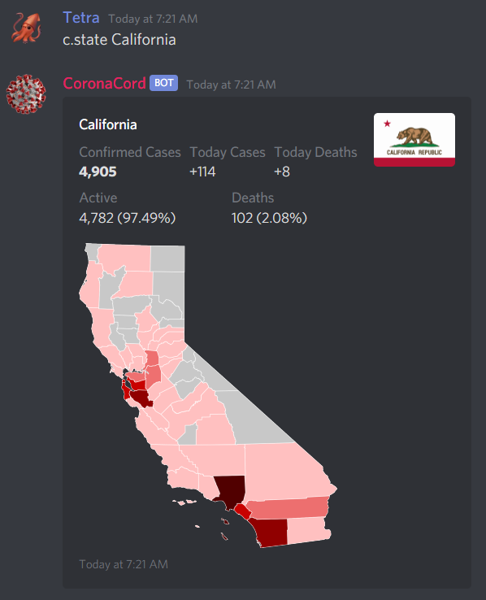
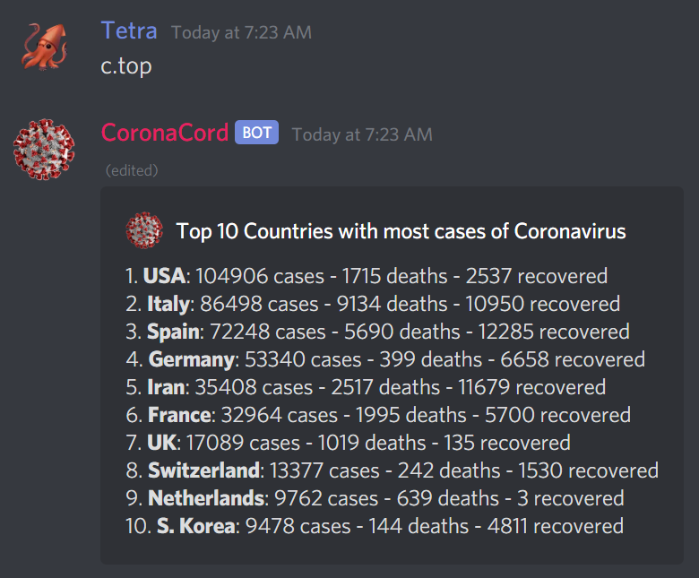

# CoronaCord

CoronaCord is a discord bot that displays the latest stastics on the corona virus. Provides info on # of confirmed cases, # of recovered and # of deaths in almost 200 countries and 50 states.

## Add to Discord
Click [here](https://discordapp.com/oauth2/authorize?client_id=644977600057573389&scope=bot&permissions=347136) to invite CoronaCord to your server. 

Coronacord's default prefix is set as `c.`. To view a list of the bot's commands type `c.help`. 

## Features

* `c.corona` Shows global stats about the coronavirus.

* 

* `c.graph <country>` Shows a graph of the coronavirus in a specific country over time.

* 

* `c.country <country>` Shows stats about the coronavirus in a specific country.

* 

* `c.state <state>` Shows stats about the coronavirus in a specific country.

* 

* `c.top` Shows the countries most infected with the coronavirus.

* 

## Self Hosting
Self hosting CoronaCord is not supported and no help will be provided. I am not responsible or liable for any self hosted clones of CoronaCord.

## Donate

